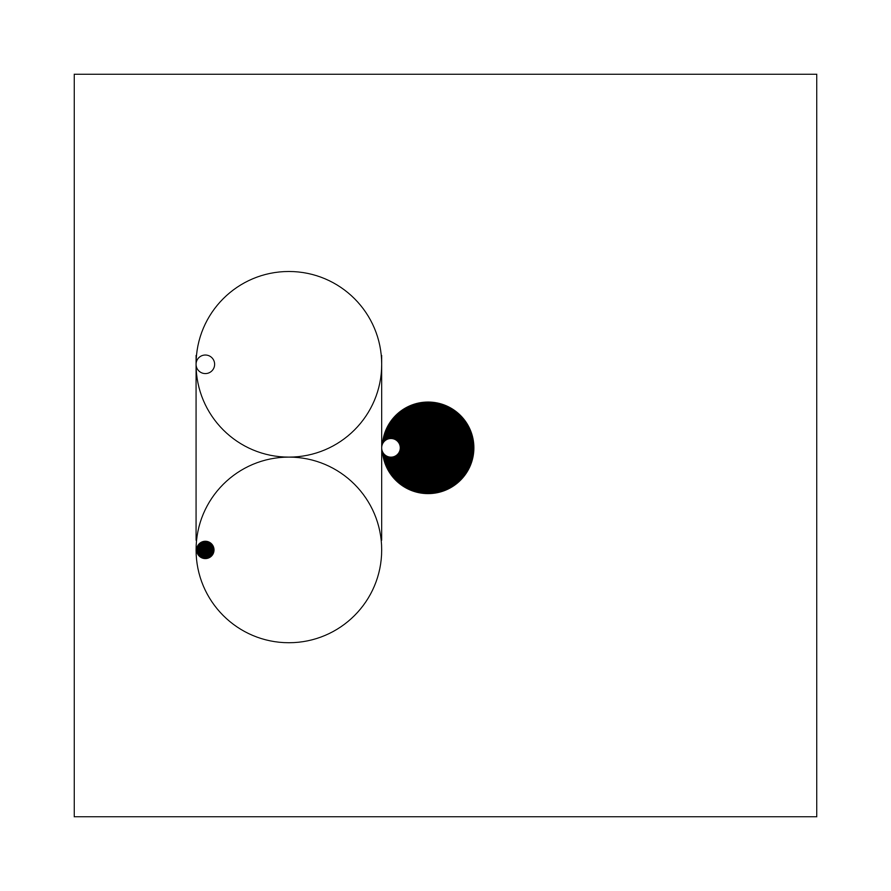

# MiniArt

The [Artwork](MiniArtLibrary/Artwork.cs) class defines a minimalist piece of art containing two lines and six shapes. By arranging these elements differently, different pieces of artwork can be created. Given such a defintion, the library can create an image from it.

## Rules for artwork

* Lines can be of any length within the confines of the frame.
* Lines can be either horizontal or vertical.
* Shapes must touch lines or each other on their edges or share a center, but they may overlap.
* All elements taken together must be continuous.
* Each artwork is given a four character name (possibly alluding to the contents of the image) consisting of two vowels and two consonants.

## Planned improvements

* Using different filters (i.e. implementations of [IArtworkFilter](MiniArtLibrary/Filters/IArtworkFilter.cs)), create vastly different images from a given artwork.
* Validation of the aforementioned rules given an artwork definition.
* Trying to apply image recognition through third-party APIs to see if it can detect something in the images (and tag them accordingly)
